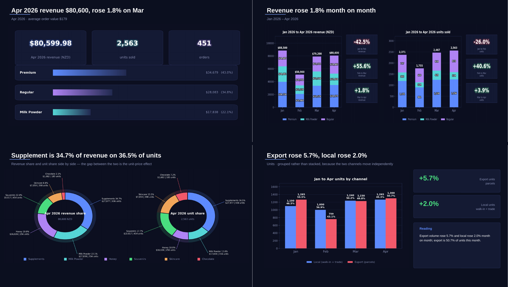

# Retail monthly report pipeline

Two spreadsheets in, a finished slide deck out, in one command.

```
python monthly.py 2026-04
```

## Why I built it

I was doing the monthly report for a health-products shop in Auckland — supplements,
milk powder and honey, sold to walk-in customers and to people who forward parcels
overseas. The data came out of the till system as a wide spreadsheet, and I put it
together in Power BI. Each month took me one to two days: reshaping columns,
re-tagging products, rebuilding visuals, then writing up what happened.

The part that bothered me was that none of it transferred. If I was away, nobody
else could produce the report, because the knowledge that made it work — which SKU
is a supplement, which range we're pushing this quarter — lived in my head and in
whatever I'd clicked last time.

So I rebuilt it as a pipeline. It now runs in about two minutes, and the store
manager runs it. She drops two files in a folder, types one command, and answers a
question or two when something genuinely new turns up.

This repo is that pipeline running on **synthetic data**. The real per-SKU revenue
and supplier list belong to the business, so `tools/make_synthetic_data.py` builds a
stand-in with invented brands that keeps the shape of the real four months, including
February's collapse in export volume.

---

## Contents

- [What comes out](#what-comes-out)
- [The problem](#the-problem)
- [Architecture](#architecture)
- [Checking the model's numbers](#checking-the-models-numbers)
- [What the language model is allowed to do](#what-the-language-model-is-allowed-to-do)
- [Design decisions](#design-decisions)
- [Bugs that changed the design](#bugs-that-changed-the-design)
- [Running it](#running-it)
- [Repository layout](#repository-layout)
- [Tests](#tests)

---

## What comes out



An 18-slide deck: cover, contents, headline figures, revenue and volume trends over
four months, product structure (category mix, the premium range, best sellers, brand
rankings, in-store pickups, supplement types), local versus export channels, revenue
concentration, and the month's operating context and campaigns.

There's a finished sample for every month in [`output/`](output/). Each folder has
the `.pptx`, the `report_data.json` every figure came from, and the `narrative.json`
the model wrote. Those narrative files are committed on purpose — step 15 reads them
if it finds them, so you can clone this repo with no API key and still see the
model-written commentary rather than the plain fallback.

Charts are matplotlib PNGs. The commentary is real text in the slide, so fixing a
word doesn't mean re-rendering an image.

---

## The problem

The store had its sales data and no way to look at it.

The point-of-sale system exports one row per SKU with three columns per month —
`jan_order`, `jan_qty`, `jan_amt`. A second export splits volume by channel.
Everything a manager wants to know is in there: whether the premium range is moving,
which brands are growing, why February fell off a cliff. Getting any of it out meant
an afternoon of pivot tables.

Three things made this harder than charting:

**The categories aren't in the data.** Nothing in the export says whether an SKU is a
supplement or milk powder, or whether it belongs to the range the store is pushing.
That lives in someone's head. It has to be captured once and remembered, or every
month costs the same as the first.

**The interesting movements need outside context.** February's export volume fell
40%. The database has no way to know that Chinese New Year ran 15–23 February and
cross-border freight stops for about two weeks either side.

**The person running it isn't technical.

---

## Architecture

```
data/raw/2026-4.xlsx      ─┐
data/raw/2026-4p.xlsx     ─┤
                           │
                    ┌──────▼────────────────────────────┐
                    │  IMPORT  (run_import.py)          │
                    │                                   │
                    │  phase 1  parse, find what's new  │
                    │           ────── stops here ──────┼──► a person answers
                    │  phase 2  classify and load       │      2 questions
                    └──────┬────────────────────────────┘
                           │
                    ┌──────▼─────────────────────────────┐
                    │  MySQL star schema                 │
                    │                                    │
                    │  dim_product ◄── the memory:       │
                    │    category / tier / shipping,     │
                    │    settled once, reused forever    │
                    │  dim_date  dim_store               │
                    │  fact_sales  fact_channel          │
                    │  monthly_context  report_config    │
                    └──────┬─────────────────────────────┘
                           │
                    ┌──────▼───────────────────────────────────────┐
                    │  REPORT  (run_report.py)                     │
                    │                                              │
                    │  12  every query → report_data.json          │
                    │      (all arithmetic happens here)           │
                    │  13  language model writes prose             │
                    │      → grounding check → narrative.json      │
                    │  14  matplotlib → chart_*.png                │
                    │  15  pptxgenjs → the deck                    │
                    └──────┬───────────────────────────────────────┘
                           │
              output/2026-04/monthly_report_2026-04.pptx
```

`monthly.py` wraps both halves so the month only has to be typed once.

---

## Checking the model's numbers

A language model writing about a table will occasionally produce a figure that looks
right and isn't there.

It happened to me. The month's revenue was 78,427.85. The generated headline said
84,427.85. Nothing crashed, no rule was broken, and the figure went onto the title
slide of a deck that reached the store owner.

My prompt already said *use only numbers from the data*, in those words. The model
still dropped a digit. Prompting turned out to be a request rather than a guarantee,
so I stopped trusting the output and started checking it.

`pipeline/grounding.py` pulls every number-shaped token out of the generated text and
confirms each one appears somewhere in `report_data.json` or the holiday calendar,
allowing for rounding. Findings come back in two buckets:

| | meaning | what to do |
|---|---|---|
| `missing` | the value isn't in the source at all | check it before publishing |
| `sign_only` | magnitude matches, sign doesn't | glance at the direction word |

Splitting them matters more than it sounds. `sign_only` fires constantly and is
almost always harmless — the model writes "fell 42.35%" where the stored value is
`-42.35`, which reads better than a minus sign. Leave them in one list and the common
harmless case buries the rare serious one, and within a month nobody reads the output
at all.

Two special cases in the tokeniser, both from false alarms I hit:

```python
if token.startswith("-"):
    following = text[match.end():]
    if DATE_WORDS.match(following):
        token = token[1:]          # "15-23 Feb" — a range, not a minus
```

An early version read `15-23 Feb` as `15` and `-23` and flagged a perfectly good
holiday date as unsourced. My first fix was to treat any hyphen between digits as a
range, which made things worse: it turned a genuine `-42.35%` positive, and that's
exactly where a fabrication could hide. The rule that handles both is narrow. A
hyphen is a range separator only when a date word follows the number.

When the check finds something, step 13 exits 3 and `run_report.py` prints the
warning again at the very end, after the filename. Anything printed mid-run scrolls
away while the charts render, and by the time you notice, the wrong figure is already
on a slide.

`tests/test_grounding.py` reproduces the original fabrication as its first test.

### What the check can't do

In March's report the model wrote:

> premium pickup fell again to NZ$1,675.84 on 25 units, **the third consecutive month
> of decline**

Every number in that sentence traces back to the source, so grounding passed it. But
the series only has three points — 2,051.28, 1,781.35, 1,675.84 — which can show at
most two consecutive declines. The word "third" was a claim about the shape of the
data with no figure attached, so there was nothing for a numeric check to catch.

I added a prompt rule about counting claims and reran it. The same sentence now reads
"fell across both February and March", which you can verify by looking at the chart.
Mechanical checking covers invented numbers. Claims made in words still need a rule
and a reader.

---

## What the language model is allowed to do

```
arithmetic  ->  Python (step 12, in `computed`)
wording     ->  the model
```

Every percentage in the report is calculated in SQL and Python, rounded, and handed
over as a finished number. The prompt forbids deriving new ones, "however simple". An
earlier version let the model work out month-on-month from raw totals and it produced
figures that appear in no version of the data.

The job I actually give it is narrow: read a number that's already correct, and say
what it means.

On February's channel slide the two paths give:

**Rule-composed**, which is what you get with no API key and no committed narrative:

> Export fell 40.0%, local fell 9.1%

**Model-drafted**, after passing the grounding check:

> Export volume fell 40.0% while local fell only 9.1% — a gap consistent with the
> Chinese New Year freight pause (15–23 Feb) rather than a change in local demand

Both are accurate and both quote the same two pre-computed numbers. The second one is
the one a manager can act on. The attribution comes from a holiday calendar loaded as
context, and it's hedged, because the data supports correlation and nothing stronger.

### The prompt is a list of past failures

`step13_generate_narrative.py` carries sixteen numbered rules. Each one is there
because the model did the thing it forbids, and each is stored with its reason. A rule
without its reason gets deleted by the next person who finds it fussy.

| rule | what prompted it |
|---|---|
| never compute a new percentage | derived month-on-month from raw totals, invented figures |
| `tier` is not a price band | called premium "high-value" and regular "budget lines" |
| no cross-category brand comparisons | ranked a milk powder brand against a supplement brand on revenue, which says nothing when unit prices differ by 10× |
| each field uses only its own slide's data | quoted a brand's share of its category on the slide showing share of the whole store |
| no verdicts, in either direction | opened with "demonstrates the effectiveness of our strategy" |
| store-floor actions only | recommended renegotiating supplier terms, which the reader can't do |
| direction words must match the sign | called a fall growth |
| counting claims need enough data points | "the third consecutive month of decline" on a three-month series |

That fourth rule is the subtle one. Both numbers were real, both were in the source,
and grounding passed. The figure was simply answering a different question from the
chart beside it.

`tier` deserves a note too. It marks the range the store wants staff to recommend.
It has nothing to do with price — a cheap souvenir can be premium and an expensive
tin of formula can be regular. Every model I gave this to assumed otherwise and
started writing about customer spending power, so that correction now sits at the top
of the system prompt.

---

## Design decisions

### The database is the memory

`dim_product` holds each SKU's category, tier and shipping mode. Once a product is
classified, nobody is asked about it again.

This is what makes the thing survivable. Month one asked about 60 brands. Month four
asked about one — a new honey supplier that first appears in April. The manual work
shrinks on its own, with no mapping file for anyone to maintain.

### Two questions a machine shouldn't answer

`run_import.py` stops for exactly two things and exits `2`, which means "a person is
needed" and is deliberately distinct from `1` for failure:

1. **A brand with no category.** New supplier, nobody has said what they sell.
2. **A product that disagrees with its brand.** A "sheep placenta 60 capsules" under a
   brand mapped to milk powder. Usually the brand is right and this one product is an
   exception.

Guess at either and every later report is quietly wrong, with nothing about the
output looking off. So they become a CSV with blanks, and the run picks up again once
they're filled in. The answers land in `dim_product` and never come back.

### Tier by rule, not a list of SKU codes

```python
PREMIUM_BRANDS = ["orama", "nonie", ...]        # whole brand
SKU_RULES = [
    {"brand": "clearfield", "keywords": ["immune", "digestion"],
     "local_pickup_only": True},                 # part of a brand
]
```

The first version was a list of SKU codes. Codes change when a supplier reissues a
product; the tier doesn't. `tier_rules.py` raises on import if a brand appears in both
lists, because that combination makes the narrowing rule unreachable while still
reading as though it works. I wrote that bug into this repo and the guard caught it.

### Where 0.85 came from

Brand names arrive spelled inconsistently — capitalisation, a missing space, the
occasional typo. `difflib` at 0.85 handles it.

Set the threshold too low and two real brands get merged: one brand's revenue
disappears into another's bar and the chart still looks completely plausible. So
rather than picking a number that felt safe, I measured. There's a test that scores
every pair of genuinely different brands and asserts the closest pair still sits below
the threshold. On the real brand list the worst pair scored 0.706.

### One switch for the reporting month

`report_config.rpt_period` — one row, one value, read by every query.

I used a table because each script opens its own connection, and a `@variable` set in
one is gone by the next. That produced NULLs which looked like missing data instead of
an error. The `config_id` primary key makes changing the month a real upsert;
without it, "change the month" could insert a second row, and every query does
`LIMIT 1`.

### Degrading instead of failing

No API key, or the call fails? The deck still builds. Every heading falls back to a
sentence composed from the same figures — accurate, just flatter. In the deck code
it's one function:

```js
function text(field, fallback) {
  const value = N[field];
  return (typeof value === "string" && value.trim()) ? value.trim() : fallback;
}
```

A report you can't produce on a given evening is worse than a plain one. It also means
you can clone this repo and get a complete deck with `python monthly.py 2026-04 --no-llm`.

### Sparse facts

No row in `fact_sales` means no sales that month. Writing zeros for every SKU in every
month it didn't sell would multiply the table by roughly twenty and add nothing, and
`SUM` over missing rows already gives you what you want.

### Re-running is always safe

Every load is `INSERT ... ON DUPLICATE KEY UPDATE` keyed on `(period, store, sku)`.
Import the same month twice and it overwrites. This matters more than it sounds,
because the natural response to "did that work?" is to run it again.

---

## Bugs that changed the design

The ones that taught me something.

**A trend query with no upper bound.** Building March's report showed April's data in
the trend chart. Every query filtered `period >= start` and none filtered
`period <= rpt_period`, because when I wrote them there was no later month to worry
about. Nothing errored. The chart just described a different month from its own title.
Now `period <= rpt_period` is on every trend query, with a test for the boundary.

**The archive wildcard.** `output/2026-02/` kept acquiring March's deck. The archive
step globbed `*.pptx` out of the working directory and swept up whatever was there.
The only symptom was two files in a folder that should have had one, and if you opened
the wrong one you got a plausible deck about the wrong month.

**The month-on-month card showed the wrong month.** The channel slide picked the most
negative month instead of the latest. I'd written it while looking at February, where
those happened to be the same month. March's deck then printed February's −40%. Test
data that only covers the case you had in mind will confirm whatever you already
believe.

**Month names hardcoded in four places.** Adding April meant editing four scripts, and
missing one gave a `KeyError` several minutes into a run — one script at a time, so it
took several passes to get through. Fixing them one by one as each error appeared was
the wrong instinct. Deriving all of them from `months_for()` was the fix.

**Step 2 wiped hand-filled categories.** It rebuilt the brand-category CSV from
scratch each month, blanking 25 brands that had been classified by hand. The next run
then asked about all of them again. There's now a three-tier precedence: previous CSV
first, then known defaults, then blank.

**A sentinel that didn't survive pandas.** `keyword_guess` returned `None` when a
product name matched no category keyword, and the caller tested `guess is None`. That
worked on my machine and crashed on someone else's: passing values through
`DataFrame.apply(axis=1)` can turn `None` into a float `NaN`, and `NaN.startswith`
raises. It only showed up on synthetic data, because every real product name happened
to contain a category word, so the branch had never executed. The sentinel is now an
empty string, which is the same type as every other return value.

**`json.dump(default=str)` hiding a type error.** MySQL returns `SUM()` as a
`decimal.Decimal`, which JSON can't serialise. The `default=str` handler quietly wrote
them out as strings, so `report_data.json` looked completely normal and the run died
two steps later in the chart renderer with `'int' + 'str'` — an error with no visible
connection to its cause. Decimals are now converted at the boundary and `json.dump`
raises on anything unexpected.

**`getpass()` on a non-interactive terminal.** Hung forever with no output, which is
the worst failure mode available because it looks like slow work. It raises now, with
a message naming the environment variable.

**A hardcoded password in five files.** Mine, in the first version. Moved to
environment variables with no default, and there's a test asserting the default hasn't
come back.

---

## Running it

MySQL 8, Python 3.10+, Node 18+ (for the deck step only).

```bash
git clone <this repo> && cd retail-report-pipeline

python -m venv .venv && source .venv/bin/activate
pip install -r requirements.txt
npm install

cp .env.example .env        # fill in MYSQL_PASSWORD
set -a && source .env && set +a

mysql -u root -p < sql/schema.sql
```

`data/raw/` already has four months in it. To regenerate them:

```bash
python tools/make_synthetic_data.py
python tools/seed_reviewed_conflicts.py
```

Then run the months in order:

```bash
python monthly.py 2026-01
python monthly.py 2026-02
python monthly.py 2026-03
python monthly.py 2026-04     # stops: a new brand appears this month
# fill in confirmed_category in the CSV it names, then
python monthly.py 2026-04 --resume
```

Without an `ANTHROPIC_API_KEY`, step 13 is skipped and the deck falls back to the
narrative already committed under `output/<period>/`. Add `--no-llm` to skip it
explicitly.

### What a month looks like for the manager

1. Drop the two spreadsheets into `data/raw/`
2. Add a row to `data/reference/monthly_context.csv` — foot traffic and campaigns,
   which aren't in the till system and have to be typed
3. `python monthly.py 2026-05`
4. Answer anything it stops to ask, then `--resume`

---

## Repository layout

```
monthly.py                 one command per month
run_import.py              spreadsheets → database, stops for judgement calls
run_report.py              database → deck, repeats warnings at the end

pipeline/
  config.py                month plumbing, paths, credentials from env
  db.py                    connection, the reporting-month switch, dim_product reads
  tier_rules.py            premium/regular rules, fuzzy brand matching
  grounding.py             the numeric verifier
  step01..step07           parse and classify (the human checkpoints live here)
  step08..step11           load into MySQL
  step12_fetch_report_data.py    every query → JSON; all arithmetic
  step13_generate_narrative.py   the model, the prompt rules, the check
  step14_render_charts.py        matplotlib
  step15_build_deck.js           pptxgenjs

sql/schema.sql             star schema, with the reasoning in comments
tools/make_synthetic_data.py   generates data/raw/
tests/                     pytest
data/reference/            human-maintained: categories, overrides, holidays,
                           monthly context
output/<period>/           the deck, plus the JSON it was built from
```

Why one JS file in a Python project: `pptxgenjs` expresses this layout in about a
third of the lines `python-pptx` needs, and the boundary between the two halves is a
JSON file, so the languages don't have to agree.

---

## Tests

```bash
pytest
```

62 tests across five files.

- `test_grounding.py` (13) — the first test reproduces the 84,427.85 fabrication. The
  rest guard against false alarms, since a check that cries wolf gets switched off.
- `test_tier_rules.py` (12) — premium rules, plus the test that scores every pair of
  real brands and asserts the closest pair sits below the fuzzy threshold.
- `test_config_and_maths.py` (15) — month-column derivation, month-on-month chain
  length, zero baselines, and that rounding survives. An unrounded
  `42.35000000000001` would never match `"42.35"` in the grounding check.
- `test_conflict_verdict.py` (16) — regression for the `None`-through-pandas crash,
  including the exact `apply` → `apply(axis=1)` → `.str.startswith` path that broke.
- `test_json_boundary.py` (6) — regression for the `Decimal` written out as a string.

The last two exist because those bugs happened, on a different machine from the one I
wrote the code on.

---

## A note on the data

Everything in `data/` is synthetic. Brands, product names and the store are invented.
The figures are generated to match the real dataset's shape — four months, a February
trough, an export channel that moves independently of the local one — without
reproducing any real commercial figure.

February's movement is designed rather than random: export volume falls 40%, local
falls 9%, and both recover in March. That asymmetry is what the report has to explain,
and it's what makes the holiday-attribution logic worth having.

---

MIT licensed.
